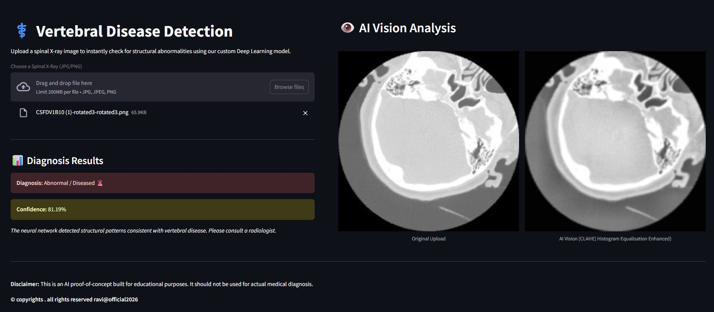

<div align="center">

# 🏥 Vertebral Disease Detection System

### AI-Powered Spinal X-Ray Analysis for Early Diagnosis

[](https://www.python.org/downloads/)
[](https://tensorflow.org)
[](LICENSE)
[](https://streamlit.io)

</div>

---

## 🔬 Overview

The **Vertebral Disease Detection System** is an end-to-end deep learning pipeline designed to classify spinal X-rays as **Healthy** or **Abnormal** with exceptional accuracy. Leveraging advanced digital image processing techniques and a custom CNN architecture, this system demonstrates the potential of AI in medical diagnostics.
___
**🌐 Live Deployment:** Try the interactive web application at **https://spine-fracture-ai.streamlit.app/**
> **⚠️ Medical Disclaimer:** This is an educational proof-of-concept project. It should **NOT** be used for actual medical diagnosis without proper clinical validation and physician oversight.

### 🎯 Project Objectives

- ✅ Build a robust binary classifier for vertebral abnormality detection
- ✅ Implement OOD detection to prevent misdiagnosis on invalid inputs
- ✅ Implement production-grade preprocessing pipelines using OpenCV
- ✅ Overcome common ML challenges (class imbalance, overfitting, gradient issues)
- ✅ Deploy an interactive web interface for real-time predictions
- ✅ Achieve research-level performance metrics

---

## ✨ Features

### 🛡️ **Out-of-Distribution (OOD) Detection**
- AI Gatekeeper validates input images before diagnosis
- Rejects non-X-ray images (photos, charts, random images)
- Prevents false diagnoses on invalid inputs
- Dual-model architecture for robust prediction

### 🧠 **Advanced Deep Learning**
- Custom CNN architecture optimized for medical imaging
- Global Average Pooling to prevent parameter explosion
- Class-weighted training to handle dataset imbalance
- Strategic dropout (60%) for robust generalization

### 👁️ **Medical Image Processing**
- CLAHE (Contrast Limited Adaptive Histogram Equalization) for enhanced contrast
- Gaussian blur filtering for noise reduction
- Standardized preprocessing pipeline
- Automated image quality normalization

### 🎨 **Data Augmentation**
- Dynamic rotation (±20°)
- Random zoom (80%-120%)
- Horizontal flipping
- Width/height shifts for translation invariance

### 🌐 **Production-Ready Deployment**
- Interactive Streamlit web interface
- Real-time image upload and prediction
- Confidence score visualization
- Responsive design for all devices

---

## 🎬 Demo

### Web Interface
```bash
streamlit run app.py
```

**Upload an X-ray → Get Instant Diagnosis**

<div align="center">

| Input X-Ray | Preprocessing | Prediction |
|------------|---------------|------------|
| Raw Medical Image | CLAHE Enhancement | Healthy / Abnormal |

</div>

### 🖥️ UI Showcase

<div align="center">



**Live Demo Interface Features:**
- 📤 Drag-and-drop file upload (JPG/PNG supported)
- 🔍 Side-by-side comparison (Original vs. CLAHE-enhanced)
- 📊 Real-time diagnosis with confidence scores
- 🎨 Clean, dark-themed professional UI
- ⚡ Instant predictions (<2 seconds)

</div>

---

## 🛡️ Training the AI Gatekeeper (OOD Detection)

To keep this repository lightweight and adhere to Git best practices, the raw image datasets are not included in version control. 

If you wish to retrain the `gatekeeper_v1.keras` Out-of-Distribution (OOD) detection model from scratch, please follow these steps to assemble the training data:

**1. Download the Data:**
* **Random Images (Class 0 - Not X-Ray):** Download the [Natural Images Dataset from Kaggle](https://www.kaggle.com/datasets/prasunroy/natural-images). Select ~200 random images (dogs, cars, people, etc.).
* **Digital Charts (Class 0 - Not X-Ray):** Download the [Data Visualization Charts Dataset from Kaggle](https://www.kaggle.com/datasets/mathurinache/data-visualization-charts) or save ~50 images of pie charts and bar graphs from Google Images.
* **Real X-Rays (Class 1 - Is X-Ray):** Gather ~200 of your existing healthy and abnormal spinal X-rays.

**2. Assemble the Folder Structure:**
Create the following directory structure and place the images inside:

```text
data/
└── gatekeeper_data/
    ├── random/       # Place the ~250 natural images and charts here
    └── xrays/        # Place the ~200 real spinal X-rays here
```

**3. Train the Model:**
Once the folders are populated, run the training script from the root directory:
```bash
python -m src.train_gatekeeper
```

---

## 🛠️ Technology Stack

<div align="center">

| Category | Technologies |
|----------|-------------|
| **Deep Learning** |   |
| **Computer Vision** |  |
| **ML Tools** |  |
| **Data Science** |   |
| **Visualization** |  |
| **Web Framework** |  |

</div>

---

## 🏗️ Architecture

### System Pipeline

```
Raw Image Upload
      ↓
🛡️ OOD Gatekeeper (Is this an X-ray?)
      ├─→ ❌ Not X-ray → Reject
      └─→ ✅ Valid X-ray
            ↓
      Preprocessing (Grayscale Conversion)
            ↓
      CLAHE Enhancement (Clip Limit: 1.2)
            ↓
      Gaussian Blur (3×3 Kernel)
            ↓
      Resize to 224×224
            ↓
      🧠 CNN Classifier Model
            ↓
      Prediction (Healthy/Abnormal)
            ↓
      📊 Confidence Score
```

**Two-Stage Architecture:**
1. **Stage 1 - OOD Detection:** `gatekeeper_v1.keras` validates input is a real X-ray
2. **Stage 2 - Classification:** `cnn_spine_v1.keras` diagnoses healthy vs. abnormal

### CNN Architecture

```
Input (224×224×1)
    ↓
Rescaling (1/255)
    ↓
Data Augmentation Layer
├─ RandomFlip (horizontal)
├─ RandomRotation (±10%)
└─ RandomZoom (±10%)
    ↓
Conv2D(32, 3×3, padding='same') → ReLU → MaxPool(2×2)
    ↓
Conv2D(64, 3×3, padding='same') → ReLU → MaxPool(2×2)
    ↓
Conv2D(128, 3×3, padding='same') → ReLU → MaxPool(2×2)
    ↓
GlobalAveragePooling2D
    ↓
Dense(128, he_normal) → ReLU
    ↓
Dropout(0.6)
    ↓
Dense(1, sigmoid) → Output
```

**Key Innovation:** GlobalAveragePooling reduced parameters from **12.8M → 16K** while maintaining accuracy!

---

## 📦 Installation

### Prerequisites
- Python 3.8 or higher
- pip package manager
- Virtual environment (recommended)

### Step-by-Step Setup

```bash
# 1. Clone the repository
git clone https://github.com/RaviKumarYadav15/vertebral-disease-detection-v1.0.git
cd vertebral-disease-detection-v1.0

# 2. Create virtual environment
python -m venv venv

# 3. Activate virtual environment
# On Windows:
venv\Scripts\activate
# On macOS/Linux:
source venv/bin/activate

# 4. Install dependencies
pip install -r requirements.txt
```

### Dependencies

```txt
opencv-python==4.8.0.76
tensorflow==2.16.1
scikit-learn==1.3.2
numpy==1.26.2
matplotlib==3.8.2
streamlit==1.29.0
pillow>=9.3.0
pandas>=1.5.0
```

---

## 🚀 Usage

### Training Pipeline

```bash
# Step 1: Preprocess raw X-ray images
python -m src.preprocess

# Step 2: Train baseline logistic regression model
python -m src.train_baseline

# Step 3: Train custom CNN model
python -m src.train_cnn

# Step 4: Compare model performance
python -m src.compare_models
```

### Web Application

```bash
# Launch Streamlit interface
streamlit run app.py
```

Then navigate to `http://localhost:8501` in your browser.

### Programmatic Inference

```python
from src.predict import predict_image

# Predict on a single image
result = predict_image('path/to/xray.jpg')
print(f"Prediction: {result['class']}")
print(f"Confidence: {result['confidence']:.2%}")
```

---

## 📁 Project Structure

```
vertebral-disease-detection/
│
├── 📂 data/
│   ├── gatekeeper_data/         # OOD detection training data
│   │   ├── random/              # Non-X-ray images (natural images, charts)
│   │   └── xrays/               # Real X-ray images
│   ├── processed/               # Enhanced images after DIP pipeline
│   │   ├── abnormal/            # Preprocessed abnormal X-rays
│   │   └── healthy/             # Preprocessed healthy X-rays
│   └── raw/                     # Original X-ray images
│       ├── abnormal/            # 500 abnormal spine X-rays
│       └── healthy/             # 500 healthy spine X-rays
│
├── 📂 models/                   # Saved model checkpoints
│   ├── baseline_logistic.pkl    # Baseline ML model
│   ├── cnn_spine_v1.keras       # Trained CNN classifier
│   └── gatekeeper_v1.keras      # OOD detection model
│
├── 📂 src/                      # Source code
│   ├── __init__.py              # Package initialization
│   ├── config.py                # Configuration & hyperparameters
│   ├── preprocess.py            # Image preprocessing pipeline
│   ├── model_cnn.py             # CNN architecture definition
│   ├── train_baseline.py        # Baseline model training
│   ├── train_cnn.py             # CNN training script with callbacks
│   ├── train_gatekeeper.py      # OOD detection model training
│   ├── predict.py               # Inference engine
│   └── compare_models.py        # Model evaluation & comparison
│
├── 📂 uploads/                  # Temporary upload directory for web app
├── 📂 venv/                     # Virtual environment (not in git)
│
├── 📄 app.py                    # Streamlit web application
├── 📊 training_history.png      # Training/validation curves
├── 📋 requirements.txt          # Python dependencies
├── 📖 README.md                 # Project documentation
└── 🔒 .gitignore                # Git ignore rules
```

---

## 🤝 Contributing

Contributions are welcome! Please follow these steps:

1. Fork the repository
2. Create a feature branch (`git checkout -b feature/AmazingFeature`)
3. Commit your changes (`git commit -m 'Add AmazingFeature'`)
4. Push to the branch (`git push origin feature/AmazingFeature`)
5. Open a Pull Request

---

## 📄 License

This project is licensed under the MIT License - see the [LICENSE](LICENSE) file for details.

---

## 🙏 Acknowledgments

- **Dataset:** Vertebral X-ray images from [Kaggle - Spine Fracture Prediction from X-rays](https://www.kaggle.com/datasets/vuppalaadithyasairam/spine-fracture-prediction-from-xrays)
- **Inspiration:** Medical AI research community
- **Libraries:** TensorFlow, OpenCV, Streamlit teams
- **Guidance:** Deep learning and computer vision best practices

---

## 📬 Contact

**Ravi** - Project Author

- GitHub: [@RaviKumarYadav15](https://github.com/RaviKumarYadav15)

---

<div align="center">

### ⭐ If you found this project helpful, please consider giving it a star!

**Made with ❤️ and 🧠 for advancing medical AI**

[⬆ Back to Top](#-vertebral-disease-detection-system)

</div>
